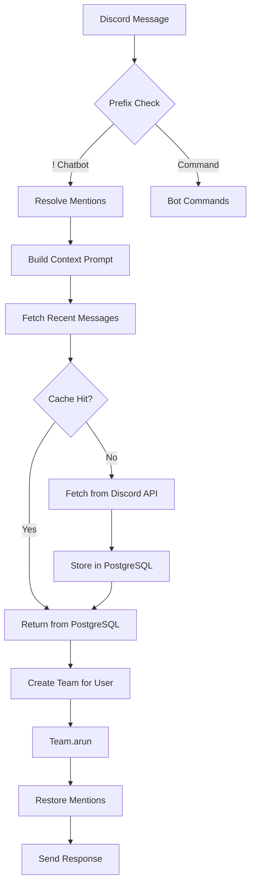

## Overview

Junkie is built on a multi-layered architecture that orchestrates AI agents to handle complex Discord interactions. The system integrates:

- **Agent Teams** - Coordinated groups of specialized AI agents
- **Context Management** - PostgreSQL-backed message caching and history
- **Tool Integration** - E2B sandboxes, MCP servers, and search APIs
- **Discord Integration** - Event-driven message handling and backfill

## Core Components

### 1. Team Orchestration Layer

The team orchestration is managed by `agent_factory.py`, which provides:

```python
async def get_or_create_team(user_id: str, client=None):
    """
    Get existing team for a user or create a new one.
    Uses LRU eviction if cache exceeds MAX_AGENTS.
    Implements proper resource cleanup when evicting teams.
    """
```

**Key Features:**
- LRU cache for team instances (`MAX_AGENTS` limit)
- Per-user team isolation with async locks
- Automatic resource cleanup on eviction
- MCP connection lifecycle management

### 2. Message Processing Flow



**chat_handler.py** coordinates this flow:

```python
async def async_ask_junkie(user_text: str, user_id: str, session_id: str, images: list = None, client=None) -> str:
    """
    Run the user's Team with improved error handling and response validation.
    """
    team = await get_or_create_team(user_id, client=client)
    result = await team.arun(
        input=user_text, user_id=user_id, session_id=session_id, images=images
    )
```

### 3. Database Layer

PostgreSQL stores conversation history with optimized indexing:

```sql
CREATE TABLE messages (
    message_id BIGINT PRIMARY KEY,
    channel_id BIGINT NOT NULL,
    author_id BIGINT NOT NULL,
    author_name TEXT NOT NULL,
    content TEXT NOT NULL,
    created_at TIMESTAMP WITH TIME ZONE NOT NULL,
    timestamp_str TEXT NOT NULL
);

CREATE INDEX idx_messages_channel_created
ON messages (channel_id, created_at DESC);
```

From `database.py:36-64`

### 4. Context Building

The context cache (`context_cache.py`) implements a two-tier retrieval strategy:

1. **Primary**: Fetch from PostgreSQL (fast, persistent)
2. **Fallback**: Fetch from Discord API and cache

```python
async def get_recent_context(channel, limit: int = 500, before_message=None) -> List[str]:
    # 1. Try DB first
    db_messages = await get_messages(channel_id, limit)
    
    # 2. If DB has insufficient data, fetch from API
    if len(db_messages) == 0:
        return await fetch_and_cache_from_api(channel, limit, before_message)
```

## Data Flow

### Startup Sequence

1. **Bot Ready** (`chat_handler.py:53-96`)
   - Initialize database pool
   - Connect MCP tools
   - Start backfill task for all channels
   - Sync recent messages to catch offline edits

2. **Message Events**
   - `on_message`: Append to cache, process chatbot commands
   - `on_message_edit`: Update cache
   - `on_message_delete`: Remove from cache

### Request Lifecycle

```python
# 1. User sends message with "!" prefix
# 2. Resolve Discord mentions to readable format
processed_content = resolve_mentions(message)

# 3. Build context-aware prompt
prompt = await build_context_prompt(
    message, raw_prompt, 
    limit=TEAM_LEADER_CONTEXT_LIMIT, 
    reply_to_message=reply_to_message
)

# 4. Set execution context for tools
set_current_channel_id(message.channel.id)
set_current_channel(message.channel)

# 5. Run team with context
reply = await async_ask_junkie(
    prompt, user_id=user_id, session_id=session_id, images=images
)
```

From `chat_handler.py:116-178`

## Resource Management

### Team Cache Eviction

When the cache exceeds `MAX_AGENTS`, the oldest team is evicted:

```python
if len(_user_teams) >= MAX_AGENTS:
    oldest_user, oldest_team = _user_teams.popitem(last=False)
    
    # Cleanup MCP connections
    if hasattr(oldest_team, 'members'):
        for member in oldest_team.members:
            if hasattr(member, 'tools'):
                for tool in member.tools:
                    if hasattr(tool, 'close'):
                        await tool.close()
```

From `agent_factory.py:376-408`

### Database Connection Pooling

```python
pool: Optional[asyncpg.Pool] = None

async def init_db():
    global pool
    pool = await asyncpg.create_pool(POSTGRES_URL)
    await create_schema()

async def close_db():
    if pool:
        await pool.close()
```

From `database.py:9-28`

## Execution Context

Tools access the current Discord channel via context variables:

```python
# Context variable to store the current channel ID
_current_channel_id: contextvars.ContextVar[Optional[int]] = 
    contextvars.ContextVar("current_channel_id", default=None)

def set_current_channel_id(channel_id: int):
    _current_channel_id.set(channel_id)

def get_current_channel_id() -> Optional[int]:
    return _current_channel_id.get()
```

From `execution_context.py:4-15`

This enables tools like `HistoryTools` to read messages from the current conversation context.

## Configuration

Key environment variables:

- `MAX_AGENTS` - Maximum cached teams (LRU eviction)
- `TEAM_LEADER_CONTEXT_LIMIT` - Max messages in context
- `POSTGRES_URL` - Database connection string
- `CONTEXT_AGENT_MAX_MESSAGES` - Max messages in cache
- `BACKFILL_MAX_FETCH_LIMIT` - Max messages per backfill fetch
