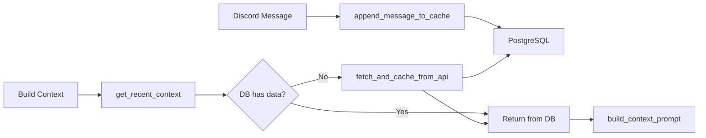

## Overview

Junkie implements a sophisticated context management system that:

- Caches Discord messages in PostgreSQL
- Builds context-aware prompts with recent conversation history
- Handles message edits and deletions
- Backfills historical messages on startup
- Formats timestamps with relative time indicators

## Architecture



## Database Schema

Messages are stored with optimized indexing:

```sql
CREATE TABLE messages (
    message_id BIGINT PRIMARY KEY,
    channel_id BIGINT NOT NULL,
    author_id BIGINT NOT NULL,
    author_name TEXT NOT NULL,
    content TEXT NOT NULL,
    created_at TIMESTAMP WITH TIME ZONE NOT NULL,
    timestamp_str TEXT NOT NULL
);

-- Optimized index for fetching recent messages (DESC order)
CREATE INDEX idx_messages_channel_created
ON messages (channel_id, created_at DESC);

CREATE TABLE channel_status (
    channel_id BIGINT PRIMARY KEY,
    is_fully_backfilled BOOLEAN DEFAULT FALSE,
    last_updated TIMESTAMP WITH TIME ZONE DEFAULT CURRENT_TIMESTAMP
);
```

From `database.py:36-62`

**Index Strategy:**
- `idx_messages_channel_created` uses DESC order for fast "latest N messages" queries
- `message_id` primary key for fast upserts

## Message Retrieval

### Two-Tier Strategy

```python
async def get_recent_context(channel, limit: int = 500, before_message=None) -> List[str]:
    """
    Get recent messages from DB or Discord API.
    """
    channel_id = channel.id
    
    # 1. Try DB first
    db_messages = await get_messages(channel_id, limit)
    
    # If we have enough messages, return them
    if len(db_messages) >= limit and before_message is None:
        formatted = []
        current_time = datetime.now(timezone.utc)
        for m in db_messages:
            rel_time = format_message_timestamp(m['created_at'], current_time)
            formatted.append(f"{rel_time} {m['author_name']}({m['author_id']}): {m['content']}")
        return formatted
    
    # 2. If DB has insufficient data, fetch from API
    if len(db_messages) == 0:
        logger.info(f"[get_recent_context] DB empty for {channel_id}, fetching from API.")
        return await fetch_and_cache_from_api(channel, limit, before_message)
```

From `context_cache.py:83-110`

**Advantages:**
1. **Fast** - PostgreSQL is much faster than Discord API
2. **Persistent** - Survives bot restarts
3. **Reliable** - No API rate limits for cached data

### Database Query

```python
async def get_messages(channel_id: int, limit: int = 2000) -> List[Dict]:
    """Retrieve the most recent messages for a channel in chronological order."""
    if not pool:
        return []
    
    try:
        async with pool.acquire() as conn:
            # ORDER BY DESC to get NEWEST messages first, then reverse to chronological
            rows = await conn.fetch("""
                SELECT message_id, channel_id, author_id, author_name, content, created_at
                FROM messages 
                WHERE channel_id = $1 
                ORDER BY created_at DESC 
                LIMIT $2
            """, channel_id, limit)
            
            # Reverse to chronological order (oldest to newest)
            return list(reversed([dict(row) for row in rows]))
    except Exception as e:
        logger.error(f"Failed to get messages for channel {channel_id}: {e}")
        return []
```

From `database.py:106-126`

**Query Optimization:**
- Fetch with `ORDER BY created_at DESC` for index efficiency
- Reverse results to chronological order for display
- Uses connection pool for performance

## Message Storage

### Upsert Strategy

```python
async def store_message(
    message_id: int,
    channel_id: int,
    author_id: int,
    author_name: str,
    content: str,
    created_at: datetime,
    timestamp_str: str
):
    """Store or update a message in the database."""
    if not pool:
        return
    
    try:
        async with pool.acquire() as conn:
            await conn.execute("""
                INSERT INTO messages (message_id, channel_id, author_id, author_name, content, created_at, timestamp_str)
                VALUES ($1, $2, $3, $4, $5, $6, $7)
                ON CONFLICT (message_id) DO UPDATE SET
                    content = EXCLUDED.content,
                    timestamp_str = EXCLUDED.timestamp_str;
            """, message_id, channel_id, author_id, author_name, content, created_at, timestamp_str)
    except Exception as e:
        logger.error(f"Failed to store message {message_id}: {e}")
        raise
```

From `database.py:66-90`

**ON CONFLICT** handles:
- New messages → INSERT
- Edited messages → UPDATE content

### Real-time Updates

```python
@bot.event
async def on_message(message):
    # Update cache with new message
    await append_message_to_cache(message)

@bot.event
async def on_message_edit(before, after):
    """Handle message edits to update cache."""
    await update_message_in_cache(before, after)

@bot.event
async def on_message_delete(message):
    """Handle message deletions to update cache."""
    await delete_message_from_cache(message)
```

From `chat_handler.py:105-213`

## Timestamp Formatting

### Relative Time Display

```python
def format_message_timestamp(message_created_at, current_time: datetime) -> str:
    """
    Format message timestamp with relative time indication.
    """
    time_diff = current_time - message_created_at
    
    if time_diff < timedelta(minutes=1):
        return "[just now]"
    elif time_diff < timedelta(hours=1):
        minutes = int(time_diff.total_seconds() / 60)
        return f"[{minutes}m ago]"
    elif time_diff < timedelta(days=1):
        hours = int(time_diff.total_seconds() / 3600)
        return f"[{hours}h ago]"
    elif time_diff < timedelta(days=7):
        days = time_diff.days
        return f"[{days}d ago]"
    else:
        return f"[{message_created_at.strftime('%b %d, %H:%M')}]"
```

From `context_cache.py:43-76`

**Examples:**
- `[just now]` - Less than 1 minute
- `[5m ago]` - 5 minutes ago
- `[2h ago]` - 2 hours ago
- `[3d ago]` - 3 days ago
- `[Jan 15, 14:30]` - More than 7 days

### Timezone Support

```python
import pytz

_timezone_str = os.getenv("DISCORD_TIMEZONE", "Asia/Kolkata")
_timezone = pytz.timezone(_timezone_str)

if _has_pytz and _timezone != timezone.utc:
    try:
        message_created_at = message_created_at.astimezone(_timezone)
        current_time = current_time.astimezone(_timezone)
    except Exception:
        pass
```

From `context_cache.py:31-60`

## Context Prompt Building

### Format

```python
async def build_context_prompt(message, raw_prompt: str, limit: int = None, reply_to_message=None):
    """
    Build a model-ready text prompt.
    """
    if limit is None:
        limit = MAX_MESSAGES_IN_CACHE
    
    user_label = f"{message.author.display_name}({message.author.id})"
    context_lines = await get_recent_context(message.channel, limit=limit, before_message=message)
    
    # Metadata
    channel_name = getattr(message.channel, "name", "DM")
    guild_name = getattr(message.guild, "name", "DM")
    
    channel_meta = (
        f"Channel ID: {message.channel.id}\n"
        f"Channel: {channel_name}\n"
        f"Guild: {guild_name}\n"
        "----\n"
    )
    
    # Current time
    now = datetime.now(timezone.utc)
    current_time_str = now.strftime("%Y-%m-%d %H:%M:%S %Z")
    
    # Reply context if present
    reply_context_str = ""
    if reply_to_message:
        reply_ts = format_message_timestamp(reply_to_message.created_at, now)
        reply_author = f"{reply_to_message.author.display_name}({reply_to_message.author.id})"
        reply_content = reply_to_message.clean_content
        reply_context_str = (
            f"\n[REPLY CONTEXT]\n"
            f"The user is replying to:\n"
            f"{reply_ts} {reply_author}: {reply_content}\n"
            f"----------------\n"
        )
    
    prompt = (
        f"{channel_meta}"
        f"Current Time: {current_time_str}\n"
        f"Timestamps are relative to this time.\n\n"
        f"Conversation History:\n"
        + "\n".join(context_lines)
        + f"\n{reply_context_str}"
        + f"\n{message_timestamp} {user_label} says: {raw_prompt}\n\n"
        f"IMPORTANT: The message above is the CURRENT message that you need to respond to."
    )
    return prompt
```

From `context_cache.py:245-308`

### Example Output

```
Channel ID: 1234567890
Channel: general
Guild: My Server
----
Current Time: 2026-03-04 15:30:00 UTC
Timestamps are relative to this time.

Conversation History:
[2h ago] Alice(111): Hey, how's the project going?
[2h ago] Bob(222): Pretty good, just finishing up the API
[1h ago] Alice(111): Nice! When can we test it?
[30m ago] Bob(222): Should be ready in an hour

[REPLY CONTEXT]
The user is replying to:
[30m ago] Bob(222): Should be ready in an hour
----------------

[just now] Alice(111) says: Great! Let me know when it's ready

IMPORTANT: The message above is the CURRENT message that you need to respond to.
```

## Backfill System

On bot startup, historical messages are backfilled:

```python
@bot.event
async def on_ready():
    # Initialize Database
    await init_db()
    
    # Get all channels
    text_channels = [
        c for c in bot.bot.get_all_channels() 
        if isinstance(c, (discord.TextChannel, discord.DMChannel, discord.GroupChannel))
    ]
    
    # Start backfill task
    async def run_backfill_and_sync():
        try:
            await start_backfill_task(text_channels)
            logger.info("[on_ready] Backfill task completed")
            
            # Sync recent messages to catch offline edits/deletes
            from discord_bot.message_sync import sync_all_channels
            sync_limit = int(os.getenv("MESSAGE_SYNC_LIMIT", "200"))
            await sync_all_channels(text_channels, sync_limit=sync_limit)
        except Exception as e:
            logger.error(f"[on_ready] Backfill/sync task failed: {e}", exc_info=True)
    
    asyncio.create_task(run_backfill_and_sync())
```

From `chat_handler.py:53-95`

### Backfill Strategy

1. **Identify gaps** - Check if channel is fully backfilled
2. **Fetch from API** - Paginate through Discord history
3. **Store in DB** - Upsert messages
4. **Mark complete** - Update `channel_status` table

### Channel Status Tracking

```python
async def is_channel_fully_backfilled(channel_id: int) -> bool:
    """Check if a channel is marked as fully backfilled."""
    if not pool:
        return False
    try:
        async with pool.acquire() as conn:
            return await conn.fetchval("""
                SELECT is_fully_backfilled FROM channel_status WHERE channel_id = $1
            """, channel_id) or False
    except Exception as e:
        logger.error(f"Failed to check backfill status: {e}")
        return False

async def mark_channel_fully_backfilled(channel_id: int, status: bool = True):
    """Mark a channel as fully backfilled."""
    if not pool:
        return
    try:
        async with pool.acquire() as conn:
            await conn.execute("""
                INSERT INTO channel_status (channel_id, is_fully_backfilled, last_updated)
                VALUES ($1, $2, CURRENT_TIMESTAMP)
                ON CONFLICT (channel_id) DO UPDATE SET
                    is_fully_backfilled = EXCLUDED.is_fully_backfilled,
                    last_updated = EXCLUDED.last_updated;
            """, channel_id, status)
    except Exception as e:
        logger.error(f"Failed to mark backfill status: {e}")
```

From `database.py:176-203`

## API Fetch and Cache

```python
async def fetch_and_cache_from_api(channel, limit, before_message=None, after_message=None):
    """Helper to fetch from API and cache to DB."""
    try:
        BACKFILL_MAX_FETCH_LIMIT = int(os.getenv("BACKFILL_MAX_FETCH_LIMIT", "1000"))
        fetch_limit = min(int(limit * 1.2), BACKFILL_MAX_FETCH_LIMIT)
        
        messages = []
        if after_message:
            async for m in channel.history(limit=fetch_limit, after=after_message):
                if m.content or m.attachments or m.embeds:
                    messages.append(m)
        elif before_message:
            async for m in channel.history(limit=fetch_limit, before=before_message):
                if m.content or m.attachments or m.embeds:
                    messages.append(m)
        else:
            async for m in channel.history(limit=fetch_limit):
                if m.content or m.attachments or m.embeds:
                    messages.append(m)
        
        # Reverse to chronological if not using 'after'
        if not after_message:
            messages.reverse()
        
        # Store in DB
        for m in messages:
            content_parts = []
            if m.content:
                content_parts.append(m.content)
            if m.attachments:
                for att in m.attachments:
                    content_parts.append(f"[Attachment: {att.url}]")
            
            content = " ".join(content_parts) if content_parts else "[Empty message]"
            
            await store_message(
                message_id=m.id,
                channel_id=channel.id,
                author_id=m.author.id,
                author_name=m.author.display_name,
                content=content,
                created_at=m.created_at,
                timestamp_str=m.created_at.strftime("%Y-%m-%d %H:%M:%S")
            )
        
        return formatted_messages
    except discord.errors.Forbidden:
        logger.warning(f"Missing access to channel {channel.id}")
        return []
```

From `context_cache.py:149-238`

**Features:**
- Includes messages with content, attachments, or embeds
- 20% buffer over requested limit
- Capped at `BACKFILL_MAX_FETCH_LIMIT` (default: 1000)
- Handles pagination with `after` and `before`

## Configuration

- `CACHE_TTL` - Cache time-to-live (unused in PostgreSQL mode)
- `CONTEXT_AGENT_MAX_MESSAGES` - Max messages in context
- `TEAM_LEADER_CONTEXT_LIMIT` - Context limit for team leader
- `DISCORD_TIMEZONE` - Timezone for timestamps (default: Asia/Kolkata)
- `MESSAGE_SYNC_LIMIT` - Messages to sync on startup (default: 200)
- `BACKFILL_MAX_FETCH_LIMIT` - Max messages per backfill fetch (default: 1000)
